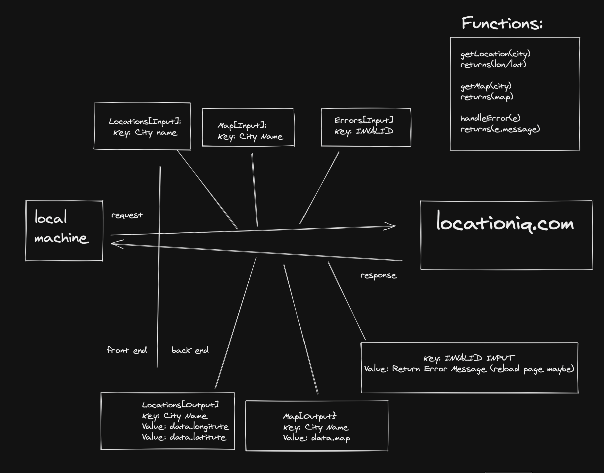

# code301-project-01

## Lab 03

- Number and name of feature: Feature \#1: Display a Modal

- Estimate of time needed to complete: 4 Hours

- Start time: 10:30 PM EST

- Finish time: 

- Actual time needed to complete: 

### Feature \#1: Display a Modal

- Why are we implementing this feature?

    - As a user, I want the image to be displayed in a larger size and with the description shown so that I can view the details of a single image.

- What are we going to implement?

    - Given that a user wants to view the details of the image
    - When the user clicks on an individual image
    - Then the image should render larger on the screen with the description displayed

- How are we implementing it?

    - Import the data.json file into your App component and send that data into the Main component
    - Map over the JSON data in your Main component to render each beast
    - Send a function into your Main component that allows the user to update state in the App
    - Create a SelectedBeast component and include it in your App
    - Use the state in the App to render an individual beast in a Modal in the SelectedBeast component using React Bootstrap

### Stretch Goal: Fuzzy search

- Why are we implementing this feature?

    - As a user, I want the ability to search my images so that I can view only the images containing specific titles or keywords.

- What are we going to implement?

    - Given that a user wants to view specific images
    - When the user enters a character into the search field
    - Then only the images matching the current set of characters should be displayed on the screen
        
- How are we implementing it?

    - Create an input element to allow users to search for an image. It is up to you to decide if the user should be able to search by title, keyword, or both.
    - Write a regular expression pattern to create a fuzzy search so that the results are narrowed down and displayed every time the user enters or removes a character from the input.

## Lab 02

Number and name of feature:
- Feature 1 - Display images
- Feature 2 - Allow users to vote for their favorite beast
- Feature 3 - Bootstrap

Estimate of time needed to complete: 4 Hours

Start time: 10:00 PM EST

Finish time: 02:00 AM EST

Actual time needed to complete: 3 Hours

### Features List

- Feature \#1: Display images

    Why are we implementing this feature?

    As a user, I want to view the images on the page so that I can browse the photo collection.
    What are we going to implement?

    Given that a user opens the application in the browser When the user navigates to the home page Then the photo gallery should display all of the images in the gallery

    How are we implementing it?

    The Main component should pass props for the title, image and description to each HornedBeast component. You will find this information in the provided JSON file.

- Feature \#2: Allow users to vote for their favorite beast

    Why are we implementing this feature?

    As a user, I want to be able to interact with the site and pick my favorite beast.
    What are we going to implement?

    Given that a user clicks on an image, the number of “favorites” displayed on that image will increase by one.

    How are we implementing it?

    Create state inside of the HornedBeast component that keeps track of the number of times an image was clicked.

    Put a heart in each horned beast with the number of times it was “favorited” next to it.

- Feature \#3: Bootstrap

    Why are we implementing this feature?

    As a user, I want to see a visually pleasing application that is also reponsive when I view this application on different screen sizes.
    What are we going to implement?

    Given that a user opens the application in the browser When the images are displayed on the screen Then each image should be rendered in a visually pleasing way The images should be displayed in columns, as screen width allows

    How are we implementing it?

    Bring in the react-bootstrap library and use it to style your application making sure that it is responsive.

- Stretch Goal: Add Interaction

## WWRC

